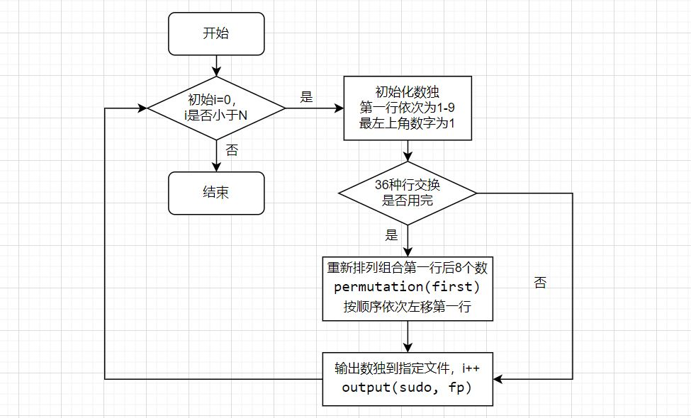
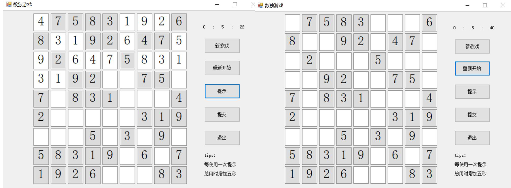
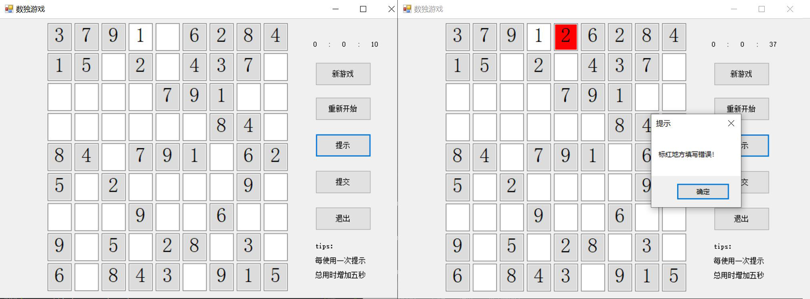
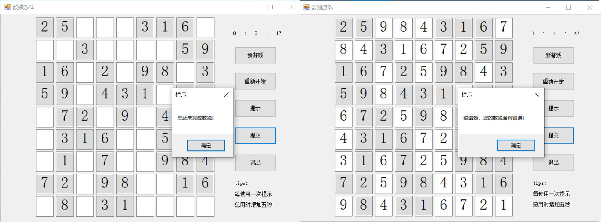

# 软件工程个人项目 —— 数独游戏
本次项目分为三个阶段
+ 第1阶段：生成终局
+ 第2阶段：求解数独
+ 第3阶段：用户界面

---

## **PSP表格**
| PSP2.1                      | Personal Software Process Stages     | 预估耗时（分钟）   | 实际耗时（分钟） |
| :-----------                | :-----------                         | :-----------      | :-----------   |
| Planning                    | 计划                                 | 120               |90              |
| · Estimate                  | · 估计这个任务需要多少时间             | 3600              |4160            |
| Development                 | 开发                                 | 1800              |2400             |
| · Analysis                  | · 需求分析 (包括学习新技术)            | 180               |180             |
| · 需求分析 (包括学习新技术)   | · 生成设计文档                        | 60                |30              |
| · Design Review             | · 设计复审 (和同事审核设计文档)        |  60               |40              |
| · Coding Standard           | · 代码规范 (为目前的开发制定合适的规范) | 30                |30              |
| · Design                    | · 具体设计                            | 180               |200             |
| · Coding                    | · 具体编码                            | 720              | 750            |
| · Code Review               | · 代码复审                            | 90               | 60            |
| · Test                      | · 测试（自我测试，修改代码，提交修改）  | 120               |120             |
| Reporting                   | 报告                                 | 120              | 180            |
| · Test Report               | · 测试报告                            | 40               | 30             |
| · Size Measurement          | · 计算工作量                          | 20               | 20             |
| · Postmortem & Process Improvement Plan    | · 事后总结, 并提出过程改进计划 |  60        |30             |
|                             | 合计                                 | 3600              |4160           |

---
## **第一阶段：生成终局**
### 一、解题思路

首先上网查阅资料，了解数独游戏规则：标准数独是由一个给与了提示数字的9x9网格组成，每行、列、宫各自都要填上1-9的数字，要做到每行、列、宫里的数字都不重复。 宫是由3×3的小格子组成的。

在刚拿到题目后，我对于数独终局的生成思路还处于一种比较模糊的状态，初步的想法是先随机生成第一行1-9九个数字，在生成第二行时，每一个数字都与第一行对应列的数字相比较，不能与之重复，以此类推。但是在初步估计时间复杂度后发现，这种方法并不理想，于是上网查阅有关数独终局的资料来寻找数独的规律，试图降低时间复杂度。

>经查阅资料可知，对于一个数独终局，第一行固定，从第二行开始，每行依次由第一行左移3、6、1、4、7、2、5、8位生成，则可以生成合格的一个数独终局。

我的学号是1120192509，第一个数字固定为 (0+9) % 9 + 1 = 1，所以通过对第一行进行全排列的方式就可以产生**8！= 40320**种终局。

此外，对于任意一个数独，第1-3行（列）、4-6行（列）、6-9行（列）中，任意两行（列）交换后数独仍然成立，在保证最左上角数字不变的前提下，可以交换4-6中任意两行，7-9中任意两行。

>中间三行的顺序可以为：456、465、564、546、654、645
>最后三行的顺序可以为：789、798、879、897、987、978

共有**8!×3!×3! = 1451520**中终局，大于要求的1000000。

### 二、求解数独程序流程图


### 三、求解数独程序函数设计
```c++{.line-numbers}
void swap(int& a, int& b);  //交换两个数
void create(int n);   //生成n个数独终局并写入文件
bool permutation(int* p);  //排列组合第一行
void flag(int f1, int f2);  //中间和末尾三行的变换
void output(int sudo[9][9], FILE* fp);  //把生成的数独写入文件输出
```
其中主要函数 bool permutation() 代码设计如下：
#### · bool permutation(int* p)
该部分代码用于对第一行后八个数字进行全排列。
```c++{.line-numbers}
bool permutation(int* p) {
    //从后往前找，发现后面的数大于前面的数，则停在后一个数
    //若没有以上情况，则证明 8！种排列已排完
    int i = 7;
    while (i > 0 && p[i] < p[i - 1])  i--;
    if (i == 0) return false;

    //从后查到i，查到大于p[i - 1]的最小的数，记入k   
    int k = i;
    for (int j = 7; j >= i; j--) {
        if (p[j] > p[i - 1] && p[j] < p[k]) k = j;
    }
    swap(p[k], p[i - 1]);

    //倒置p[last]到p[i]   
    for (int j = 7, k = i; j > k; j--, k++) {
        swap(p[j], p[k]);
    }
    return true;
}
```
<br></br>


## **第二阶段：求解数独**
### 一、解题思路

在刚拿到题目后，我最开始想到的是暴力求解，但是题目的范围是1-1000000道，暴力求解时间复杂度过高，在查找资料后采用深搜和剪枝的方法。

数独的求解主要参照了资料[数独求解方法](https://blog.csdn.net/youngyangyang04/article/details/110095497)，对于空白格子，按照1-9的顺序尝试填入数字，看这个数字在所在行/列/九宫格中是否和其他格子重复，排除不符合要求的数字。如果最终发现1-9每一个数字都不符合要求，则可能是上一个格子填入错误，需要返回上一个空格尝试下一个数字。

### 二、求解数独程序流程图


### 三、求解数独程序函数设计
```c++{.line-numbers}
void solve(const char* txt);  //依次读取每个数独并求解
void resolve(int row, int col);  //求解数独的dfs
bool isValid(int row, int col);  //判断行、列、九宫格是否有重复
void s_output();  //把求解的数独写入文件输出
```

其中主要函数 resolve() 和 isValid() 代码设计如下：
#### · isValid(int row, int col)
该部分代码主要用于深搜的剪枝，判断填入空格的数字是否合法：
把数字填入空格时，该数字不能与所在行、列、九宫格重复，如果重复，则返回false，如果没有重复，则返回true。
```c++{.line-numbers}
bool isValid(int row, int col) {
    int num = s_sudo[row][col];
    for (int i = 0; i < 9; i++) {  //这一列有重复的
        if (s_sudo[i][col] == num && i != row)return false;
    }
    for (int j = 0; j < 9; j++) {  //这一行有重复的
        if (s_sudo[row][j] == num && j != col)return false;
    }
    int x = (row / 3) * 3;
    int y = (col / 3) * 3;
    for (int i = x; i < x + 3; i++) {  //所在九宫格有重复的
        for (int j = y; j < y + 3; j++) {
            if (s_sudo[i][j] == num && i != row && j != col)return false;
        }
    }
    return true;
}
```

#### · resolve(int row, int col)
数独的求解部分采用深度优先搜索，为了减少搜索时间，使用 isValid() 剪枝，如果填入的数字不合法，则尝试下一个数字，直到找到合适的数字为止；如果不存在合法数字，则返回上一个空，重新填写。

在进行了性能分析报告后，发现此函数占用时间较多，为了进一步优化程序减少时间，还应该尽可能减少上一个空格填错数字的可能性，因此可以从空格最少的一行开始填写。以下是深搜函数的流程图和代码：

```c++{.line-numbers}
void resolve(int row, int col) {
    if (isOK == 1)return;
    blank[row]--;
    for (int i = 1; i < 10; i++) {
        s_sudo[row][col] = i;
        if (isValid(row, col)) {
            //这一行还有空格
            if (blank[row] > 0) {
                int j;
                for (j = 0; j < 9; j++) {
                    if (s_sudo[row][j] == 0)break;
                }
                resolve(row, j);
            }

            //这一行没有空格了
            else {
                int next_row = -1;
                for (int k = 0; k < 9; k++) {  //找到下一个空白最少的一行
                    if (blank[k] == 0)continue;
                    if (next_row == -1)next_row = k;
                    if (blank[k] < blank[next_row])next_row = k;
                }
                if (next_row == -1) {  //数独没有空行了
                    isOK = 1;
                    return;
                }
                int j;
                for (j = 0; j < 9; j++) {
                    if (s_sudo[next_row][j] == 0)break;
                }
                resolve(next_row, j);
            }
            if (isOK == 1)return;
        }
    }
    //9个数字都尝试完，没有符合要求的，证明上一个数字填错了，返回
    s_sudo[row][col] = 0;
    blank[row]++;
    return;
}
```

## **第三阶段：用户界面**
### 一、解题思路
在Visual Studio 2019中新建 Windows 窗体应用项目，为游戏设计大体功能：**新游戏、重新开始、提示、提交、退出**。

#### （1）新游戏
用户点击“新游戏”，数独棋盘随机生成新的数独题目，计时从0开始。用户可以在棋盘上的空格里填写数字1-9，或者按退格删除填写的数字。开始游戏后，用户可以选择重新开始、提示、提交、退出。用户每一次点击“新游戏”，棋盘上都会生成新的题目。

#### （2）重新开始
用户点击“重新开始”，现在棋盘上已经填写的数字会被清空，用户可以重新开始计算这局数独，计时不会清零。

#### （3）提示
用户点击“提示”，从棋盘第一个空开始依次扫描，当发现有填写错误的空时，错误的地方标红作为提示；如果在扫描出错误之前发现有空白的空，则显示此空的正确答案作为提示。每使用一次提示，总计时会增加五秒作为惩罚计时。

#### （4）提交
用户点击“提示”，系统检测整个棋盘，如果用户还有空格未填写，提示数独未完成；如果填写完成但是与答案不符，提示数独填写有错误；如果用户填写与答案一致，则恭喜用户完成数独，同时停止计时，显示用户解出数独的时间。

#### （5）退出
用户可以在任意时刻点击“退出”，点击后窗口会关闭。

### 二、用户界面顺序图


### 三、用户界面程序设计
用户界面程序总共包含两个类，两个类中的函数分别如下：
```c++{.line-numbers}
public partial class Form1 : Form  //窗口界面
public class sudoku  //数独生成和求解
```
```c++{.line-numbers}
public Form1()
private void Form1_Load(object sender, EventArgs e)  //窗口
private void Txt_KeyPress(object sender, KeyPressEventArgs e)  //让用户只能输入数字1-9或退格键
private void Init()  //初始化数独棋盘
private void button1_Click(object sender, EventArgs e)  //点击开始新游戏
private void Quit_Click(object sender, EventArgs e)  //退出
private void Submit_Click(object sender, EventArgs e)  //点击提交并判断题目完成度
private void Tips_Click(object sender, EventArgs e)  //提示
private void Restart_Click(object sender, EventArgs e)  //重新开始本局
private void timer1_Tick(object sender, EventArgs e)  //计时器
```
```c++{.line-numbers}
public sudoku()
public void flag(int f1, int f2)  //中间和末尾三行的变换
void output(int flag_mid, int flag_end)  //把生成的数独根据变换写入question[,]，answer[,]
public void b_blank()  //给数独题目question[,]挖空
public void create(int[] first)  //生成初始数独终局并写入question[,]，answer[,]
```
关键功能代码详情如下：
#### （1）生成数独题目和新游戏
为了使题目具有随机性，且题库数量大于1000000，对于第一行的生成采用随机数的方法，随机生成1-9不重复的九个数，以此代替按顺序对第一行排列组合，关键代码如下：
```c++{.line-numbers}
//生成数独第一行1-9随机数，每个数字各不重复
 Random r = new Random();
            for (int i = 0; i < array.Length; i++)
            {
                array[i] = r.Next(1, 10);
                if (i > 0)
                {
                    for (int j = 0; j < i; j++)
                    {
                        if (array[i] == array[j])
                        {
                            i--;
                            break;
                        }
                    }
                }
            }
```
在确定第一行之后，按照第一阶段生成数独终局的方法，通过对第一行进行不同位次的左移，生成初始数独终局。

为了保证变换的充足性，在生成数独终局的基础上，对于确定行交换的变量flag_mid、flag_end，采取生成1-6随机数的方式，来随机决定生成的数独终局是否进行4-6、7-9行的交换，代码如下：
```c++{.line-numbers}
//第j行为第一行左移shift[j]，变换出完整的数独
            for (int j = 1; j < 9; j++)
            {
                for (int k = 0; k < 9; k++)
                {
                    sudo[j, k] = sudo[0, ((k + shift[j - 1]) % 9)];
                }
            }          

            Random rand = new Random();
            flag_mid = rand.Next(1, 7);
            flag_end = rand.Next(1, 7);
            output(flag_mid, flag_end);
```
确认最终的数独题目后，把数独终局存入sudoku类中的question[,]，answer[,]数组，answer[,]储存完整的数独终局作为答案，question[,]随机进行挖空，生成带空的数独题目，并且保证每个3×3的小九宫格都至少含有两个空，代码如下：
```c++{.line-numbers}
 public void b_blank()
        {
            Random rdm = new Random();
            int blank = rdm.Next(30, 61);  //生成30 - 60 个空

            //9个3X3，每个3X3的小棋盘中挖空不少于2个。
            for (int i = 0; i < 9; i++)
            {
                for (int j = 0; j < 2; j++)
                {
                    int position = rdm.Next(9);   //选择3X3里空的位置
                    int x = i / 3 * 3 + position / 3;
                    int y = i % 3 * 3 + position % 3;

                    //如果这个位置没被挖空，则挖空，反之，再随机一个数
                    if (question[x, y] != 0)   
                    {
                        question[x, y] = 0;
                        blank--;
                    }
                    else
                    {
                        j--;
                        continue;
                    }
                }
            }

            //空还有剩余
            while (blank > 0)  
            {
                int i = rdm.Next(9);
                int j = rdm.Next(9);
                if (question[i, j] != 0)  //没有被挖空
                {
                    question[i, j] = 0;
                    blank--;
                }
            }
        }
```
确认题目后，将数独题目传入新游戏的textbox[,]数组中，没有挖空的地方设置为只读模式，且底色设置为浅灰色，计时开始。代码和最终效果如下：
```c++{.line-numbers}
//生成数独题目并挖空，将题目填入txetbox
            sudoku.create(array);         
            for(int i = 0; i < 9; i++)
            {
                for(int j = 0; j < 9; j++)
                {
                    textbox[i, j].Text = "";  //每点击一次新游戏，都要归零每一个空格
                    textbox[i, j].BackColor = Color.White;
                    textbox[i, j].ReadOnly = false;
                    if (sudoku.question[i, j] != 0)
                    {
                        textbox[i, j].Text = sudoku.question[i, j].ToString();
                        textbox[i, j].ReadOnly = true;
                        textbox[i, j].BackColor = Color.FromArgb(220,220,220);
                    }
                }
            }

            //开始新游戏时，重新开始计时
            if (timer1.Enabled == true)
            {
                timer1.Enabled = false;
                label_h.Text = "0";
                label_m.Text = "0";
                label_s.Text = "0";

            }
                
            timer1.Enabled = true;
```


#### （2）重新开始
扫描整个棋盘，把非只读模式的格子重新清空。代码和最终效果如下：
```c++{.line-numbers}
private void Restart_Click(object sender, EventArgs e)
        {
            for(int i = 0; i < 9; i++)
            {
                for(int j = 0; j < 9; j++)
                {
                    if (textbox[i, j].ReadOnly == false) textbox[i, j].Text = "";
                }
            }
        }
```


#### （3）提示
提示会根据用户的大题情况，提示答案或者提示错误，代码和最终效果如下：
```c++{.line-numbers}
private void Tips_Click(object sender, EventArgs e)
        {
            flag_tips = 1;
            int e_flag = 0;  //e_flag == 1 为提示完毕
            for(int i = 0; i < 9; i++)
            {
                for(int j = 0; j < 9; j++)
                {
                    //有空的地方则填上
                    if(textbox[i, j].Text == "")
                    {
                        textbox[i, j].Text = sudoku.answer[i, j].ToString();
                        e_flag = 1;
                        break;
                    }

                    //有错误则提示
                    if(textbox[i, j].Text != "" && textbox[i, j].Text != sudoku.answer[i, j].ToString())
                    {
                        textbox[i, j].BackColor = Color.Red;
                        MessageBox.Show("标红地方填写错误！", "提示");
                        textbox[i, j].BackColor = Color.White;
                        e_flag = 1;
                        break;
                    }
                }
                if (e_flag == 1) break;
            }
        }
```


#### （4）提交
根据用户不同的答题情况，提交效果分别如下图所示：



#### （5）关于计时器
设定每隔一秒触发一次time控件，每触发一次，秒数加一；如果使用了“提示”，秒数加五。把总共耗时的秒数换算成时分秒显示在三个Lable控件上，当点击新游戏时，三个显示时间的Label控件全部归零。代码如下：
```c++{.line-numbers}
public Form1()
        {
            InitializeComponent();
            Init();

            //提交、提示、重新开始按钮不可用
            Submit.Enabled = false;
            Restart.Enabled = false;
            Tips.Enabled = false;

            //初始化计时器
            label_h.Text = "0";
            label_m.Text = "0";
            label_s.Text = "0";
            timer1.Interval = 1000;

            label_tips.Text = "tips：" + "\n\n" + "每使用一次提示" + "\n\n" + "总用时增加五秒";
        }
```

```c++{.line-numbers}
private void timer1_Tick(object sender, EventArgs e)
        {
            int hour = Int32.Parse(label_h.Text);
            int min = Int32.Parse(label_m.Text);
            int sec = Int32.Parse(label_s.Text);
            sec++;
            
            //如果使用了提示，时间额外加5s
            if (flag_tips == 1)
            {
                sec += 5;
                flag_tips = 0;
            }

            //计算小时
            if (min == 60)
            {
                hour++;
                label_h.Text = hour.ToString();
                label_m.Text = "0";
                if (hour == 100)
                {
                    timer1.Enabled = false;
                    MessageBox.Show("计时器已达到上限", "提示");
                    return;
                }
            }
            //计算分钟
            if (sec >= 60)
            {
                min++;
                label_m.Text = min.ToString();
            }
            //计算秒
            sec = sec % 60;
            label_s.Text = sec.ToString();

        }
```
>此设定的缺陷：如果用户在一秒内连续点击多次提示，由于time控件每秒只会触发一次，因此只会增加一次惩罚时间（5s）。由于时间原因，此bug暂未修复，会在以后的学习中完善。

## 总结
在这个项目的设计当中，我查阅了很多资料，也参考了很多资料中设计数独、求解数独的思路，增加了独立完成项目代码的经验。同时本次项目是我第一次使用git进行代码提交，第一次尝试用markdown编写博客，第一次对代码进行单元测试和性能分析，第二次利用Windows窗口应用进行GUI的用户界面设计，在收获许多新的方法和技巧时，也初步了解了一个项目开发的经过，增加了自己的项目经验。

同时由于时间和经验的原因，这个项目的功能还不是很完善，例如time控件对惩罚时长的计算存在一些小缺陷，无法判断数独题目是否有唯一解等，在以后的深入学习中，我会进一步提升自己的能力，来完善他们。

>出于商业和实用价值，可以考虑在用户使用“提示”功能时，让他们看30s广告来获取收益（手动狗头）

