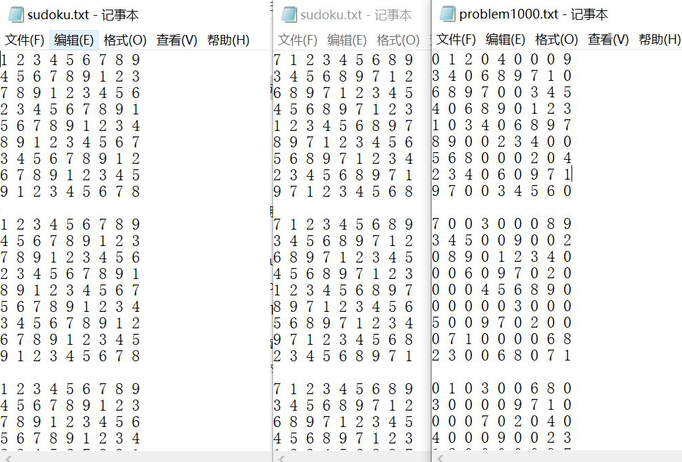

# 软件工程个人项目 —— 数独游戏
本次项目分为三个阶段
+ 第1阶段：生成终局
+ 第2阶段：求解数独
+ 第3阶段：用户界面

本博客主要说明**测试与性能分析**。

---
## **一、单元测试**
单元测试采用了Visual Studio 2019自带的本机单元测试模板，主要参考资料为[单元测试入门](https://docs.microsoft.com/zh-cn/visualstudio/test/getting-started-with-unit-testing?view=vs-2022&tabs=dotnet%2Cmsunittest)，测试覆盖率采用了扩展工具OpenCppCoverage，主要参考资料为[VS2019 单元测试覆盖率](https://www.cnblogs.com/QiTang/p/12578351.html)。

项目主要包含以下几个函数，几个函数之间的关系如下图所示：
```c++{.line-numbers}
void swap(int& a, int& b);
void create(int n);   //生成n个数独终局并写入文件
bool permutation(int* p);  //排列组合第一行
void flag(int f1, int f2);  //中间和末尾三行的变换
void output(int sudo[9][9], FILE* fp);  //把生成的数独写入文件输出

void solve(const char* txt);  //依次读取每个数独并求解
void resolve(int row, int col);  //求解数独的dfs
bool isValid(int row, int col);  //判断行、列、九宫格是否有重复
void s_output();  //把求解的数独写入文件输出
```

在单元测试中，输出函数 output() 和 s_output() 的结果可以在输出文件 sudoku.txt 中体现，因此没有设计测试用例。

create 部分，swap() 函数设计了边界测试用例；permutation()、flag() 函数设计了条件覆盖性测试用例。solve 部分，isValid()、resolve() 设计了条件覆盖测试用例。

main 主函数部分仅涉及对输入参数的判断，未额外在单元测试程序 UnitTest1.cpp 中设计测试用例，测试如下图所示：

测试分支覆盖率和正确性如下图所示：


## **二、集成测试**
### 正确性测试
在正确性测试中，生成和求解1-1000个数独终局的时间应在60s内，数独的数目越大，所需时间越多。分别测试生成/求解10、1000个数独，消耗时间均少于60s，测试结果和输出文件分别如图所示：



## **三、性能分析**
### （一）生成和求解数独
性能分析采用了Visual Studio 2019自带的性能探查器，主要分析了CPU的使用率。性能分析报告在./1120192509/sudoku/Performance文件夹中。

在性能分析中，性能测试中输入范围限制在 10000-1000000。生成和求解数独的性能分析结果分别如下图所示：


从图中可以看出，除去外部函数外，生成和求解数独的输出函数 output() 时间占比最多；在求解数独部分，寻找可行解的深搜函数 resolve() 时间占比最多。为了节省深搜的时间，可以优先从含有最少空白的一行开始搜索，在修改后，resolve() 的时间复杂度极大的减少，之前的博客也做出了相应的修改。

### （二）数独游戏用户界面GUI
性能分析采用了Visual Studio 2019自带的性能探查器，主要分析了CPU的使用率。性能分析报告在./1120192509/SudokuGui/Performance文件夹中。

从性能分析报告中可以看出，占用时间较多的是外部代码，程序本体占用时间较少。在实际的用户使用中，无论是生成数独题目还是其他功能，都可立刻给到用户反馈，不存在卡顿情况。
